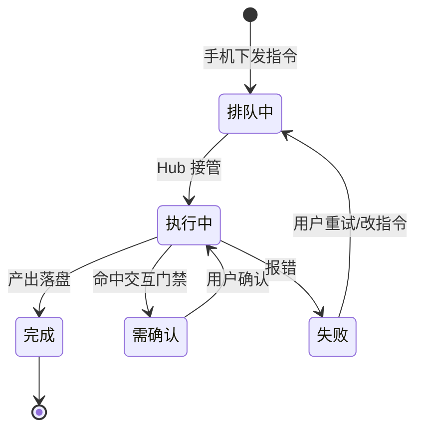

# Popwave 手机端（远程控制 + 产出预览）PRD

版本：v0.1（MVP 定义稿）
作者：pop
日期：2026-08-06
状态：待评审

---

## 一、需求背景与目标

### 1.1 背景

popwave（泡泡）是一套跑在用户本地电脑上的小说/漫画/视频创作 agent 体系（pop）。它通过 TRAE 环境执行，把 skill 包驱动的创作流程落到本地工作区，持续产出三样东西：`正文/ch{NNN}.txt`（小说正文）、`*.md`（设定/大纲/current-state/导演卡等结构化文档）、`*.png`（漫画页/角色立绘/封面）。

当前 popwave 只能在本机操作。一旦用户离开电脑（最常见的场景是**人在公司、电脑在家**），就无法继续派任务、看进度、验收产出。用户现有诉求全部被锁死在本机。

### 1.2 目标

构建一个 popwave 手机端，让用户从任意网络（手机流量/公司网络）远程触达家里电脑上的 popwave，实现两件事：

1. **发指令**：像聊天一样给 pop 下任务（如"继续写第 5 章""跑拆书""给第三章出漫画导演卡"），由电脑端执行。
2. **看产出**：实时看到运行进度，并直接预览 popwave 产出的 `.txt`、`.md`、`.png` 三种文件。

### 1.3 非目标（明确不做）

- 本版本不做手机端本地创作/编辑，只做"派单 + 预览 + 监控"。
- 不做 iOS/Android 原生 App（先做网页 PWA，跑通后再评估原生）。
- 不做多用户/账号体系，仅服务"自己的电脑 + 自己的手机"这一对一私有场景。

（标注：1.3 为 PM 判断，若后续要开放给他人使用需重新评估。）

---

## 二、核心用户与场景

### 2.1 用户画像

| 维度 | 描述 |
|------|------|
| 角色 | 个人创作者，popwave 体系的唯一操作者 |
| 使用频率 | 每天通勤/午休/下班路上多次，加上工作间隙抽查 |
| 痛点强度 | 高——电脑在家就跑不了东西，创作节奏被打断 |

### 2.2 核心使用场景（按优先级排序）

**S1 通勤派单**：在公司/路上，用手机给 pop 说"把《深渊主宰》第 6 章写出来"，放下手机去开会，回来看到章节已写好、能预览文本。

**S2 进度抽查**：家里电脑正在跑长任务（如 30 章合批拆书、批量漫画渲染），用户在手机上随时看跑到第几步、有无报错，不必等回家。

**S3 产出验收**：漫画/Png 出图后，用户在路上快速看图（分页翻漫、缩放细节），确认方向对不对，回家再精修。

**S4 方向确认**：用户在手机上浏览近期 md 产出（current-state、导演卡、设定库），判断剧情/设定走向，给 pop 追加一句调整指令。

---

## 三、总体架构

### 3.0 手机端信息架构（对标编辑器）

整个手机端对标 **TraeWork / 代码编辑器**的布局心智，用户打开就知道"哪是对话框、哪是渲染区"。四级页面流：

| 层级 | 页面 | 对标编辑器 | 说明 |
|------|------|-----------|------|
| 引导 | 配对页 | 登录/初始化 | 首次启动一次性；绑定后进入首页 |
| 首页 | 项目列表 | 侧边栏文件树 | 列出所有创作项目，每项显示最近产出与在线状态 |
| 主界面 | 项目工作页 | 主画布区 | 进项目后在这里干活，是"主对话框"所在地 |
| 渲染区 | 产出预览 | 右侧渲染/预览面板 | 展示该项目选中文件的渲染结果 |

**主界面 = 对话 + 渲染双视图**。手机屏幕窄，用**底部导航条**在「对话」和「产出」两个视图间切换，逻辑对标编辑器的"对话面板 / 预览面板"分屏，但手机上改为上下/左右切换：

```
┌──────────────────────────────┐
│  深渊主宰  ·  电脑在线          │
│  ┌────────────────────────┐  │
│  │   (对话/产出 切换区)      │  │
│  │  主内容区：              │  │
│  │  · 对话视图 = 消息流+输入框 │  │
│  │  · 产出视图 = 渲染区       │  │
│  └────────────────────────┘  │
│  ┌──────┬──────┬──────┐      │
│  │ 对话  │ 产出   │ 文件   │   │
│  └──────┴──────┴──────┘      │
└──────────────────────────────┘
```

「对话」视图承载：和 pop 的消息流 + 底部指令输入框（对应模块 2）。「产出」视图承载：文件渲染区，点开某个产出文件就在这里显示（对应模块 4）。「文件」视图承载：按项目浏览目录树，点文件跳到对应渲染区（对应模块 4.4）。

### 3.1 连接模型

核心难题：**家里电脑在 NAT 后无公网 IP，手机要从公司访问**。对比两条可行路径：

| 方案 | 原理 | 手机侧 | 优点 | 缺点 |
|------|------|--------|------|------|
| A. Tailscale 组网 | 桌面 Hub 监听 tailnet 内网 IP | 手机装 Tailscale App 后用浏览器访问 | 安全、无需自建 backend、文件直连快 | 手机要装 App；公司网络可能限制点对点 |
| B. 云中继（推荐） | 桌面 Hub 主动外连中继服务，手机 PWA 也连中继，中继转发信令与文件 | 浏览器打开即用，零安装 | 任何网络可用、无需公网 IP、PWA 天然适配 | 需一个轻量中继 backend；文件经中继转发有带宽 |

**推荐方案 B 作为 MVP**：手机浏览器直接打开 PWA，不装任何东西，通勤/公司/流量都能用。文件预览按需懒加载（只拉用户点开的那张 png / 那一段 txt），避开全量同步。方案 A 作为后续增强，当用户在意"文件直连速度与隐私"时切换。

### 3.2 三层架构

```
┌─────────────┐      ┌──────────────┐      ┌──────────────────────────────┐
│  手机端 PWA  │      │   云中继服务   │      │       桌面 Hub（家里电脑）      │
│  ○ 对话控制   │◄────►│  WebSocket  │◄────►│  ○ 桥接 popwave 执行运行时      │
│  ○ 状态流    │  信令 │  信令转发     │  信令 │  ○ 工作区文件监控与文件服务      │
│  ○ 产出预览  │──(按需)──►│  文件代理     │◄──(按需)──│  ○ 设备配对与鉴权            │
│  ○ 通知      │      │               │      │                              │
└─────────────┘      └──────────────┘      └──────────────────────────────┘
```

- **手机端 PWA**：用户交互的唯一入口，无业务逻辑，纯界面 + WebSocket 客户端。
- **云中继服务**：轻量常驻服务，维护"手机↔Hub"两条长连接，做双向信令路由与文件按需代理。不落库、不存文件，无状态转发。
- **桌面 Hub**：长驻用户电脑，开机自启。它主动外连中继（解决 NAT），桥接 popwave 执行、监听工作区文件变化、对外提供文件与状态。

### 3.3 桌面 Hub 的执行模型（关键实现决策，需确认）

手机发来"继续写第 5 章"，谁来真正执行？两条路径：

- **路径 1 · 独立运行时**：Hub 复用现有 skill 包 + pop 身份，通过 headless agent 运行时（CLI agent 或 LLM API 直调）在本地执行，产出写入同一工作区。手机指令可完全自主跑通，无需人在电脑前。
- **路径 2 · TRAE 内嵌驱动**：Hub 通过 TRAE 的自动化/远程接口驱动 TRAE 里已有的 pop 会话执行。好处是复用 TRAE 现有会话与记忆，坏处是依赖 TRAE 是否开放可编程接口，且需保持 TRAE 常开。

**推荐 MVP 走路径 1**：与"电脑在家、人在公司、要自主跑"的诉求最匹配——手机派单后无需电脑端有人值守。TRAE 仍作为本机复杂交互的主入口，"在 TRAE 基础上"体现在 **共享同一工作区目录、同一 skill 体系、同一 pop 身份**，而非必须复用 TRAE 进程。路径是否可行，取决于 headless 运行时的成熟度，列为实现可行性待验证项。

（标注：3.3 为影响实现范围的关键决策，落地前需与开发确认路径 1 运行时可行性。）

### 3.4 安全设计

- **配对手势**：用户在家电脑上首次启动 Hub 时，生成一次性配对码/二维码；手机第一次连接输入后完成绑定，双向建立信任。
- **传输**：中继全链路 TLS；信令走加密 WebSocket，文件走 HTTPS。
- **鉴权**：绑定后手机端持有设备令牌，所有请求带令牌校验；中继只转发已配对设备间的消息。
- **目录白名单**：Hub 默认只暴露 `popwave/paopao-workspace/projects/` 下各项目目录，杜绝手机访问任意文件系统。
- **无状态中继**：中继不落库、不存文件内容，降低隐私面。

---

## 四、功能需求详述（核心）

> 采用"逐模块 + 原型"结构。因本 PRD 输出为 Markdown，交互原型用 ASCII 线框图 + Mermaid 状态图表达（HTML 版可替换为可点击 Demo）。

### 模块 1 · 连接与配对

**场景**：首次使用，把手机与家里电脑绑定。

**页面布局**

```
┌──────────────────────────────┐
│  Popwave 手机端               │
│  ┌────────────────────────┐  │
│  │  未连接                 │  │
│  │  电脑端配对码:  A8K-3FQ  │  │
│  │  [输入配对码]           │  │
│  │  [X  X  X-X X X]        │  │
│  │  [  连接并绑定  ]        │  │
│  └────────────────────────┘  │
│  状态: 电脑在线 · 等待配对      │
└──────────────────────────────┘
```

**业务逻辑**：手机打开 PWA → 若未绑定，显示配对页 → 用户输入电脑 Hub 上显示的 6 位一次性配对码 → 手机向中继发起绑定请求 → Hub 校验配对码并确认 → 双向绑定建立，手机端保存设备令牌 → 进入会话列表。电脑端可随时作废令牌，作废后手机需重新配对。

**边界与异常**：

| 异常 | 处理 |
|------|------|
| 电脑不在线 | 显示"电脑离线"，配对不可用，提示先确认家里电脑已开机且 Hub 已启动 |
| 配对码错误/过期 | 提示重新读取电脑端最新配对码 |
| 绑定后电脑断线 | 状态降级为"电脑离线"，保留会话与文件浏览的缓存索引 |

### 模块 2 · 对话式控制（发指令）

**场景**：用户在手机上像聊天一样给 pop 下任务。

**页面布局**

```
┌──────────────────────────────┐
│  ◁ 项目：深渊主宰              │
│  — 会话 3  ·  电脑在线         │
│                              │
│  [pop] 已读 current-state，    │
│  第6章硬锚点就绪，开始写作。    │
│  ✓ 已写入 正文/ch006.txt      │
│                              │
│  你: 改成更紧张的开场，动作提前  │
│  [pop] 已调整，见 ch006 1-3 段  │
│                              │
│  ┌──────────────────────────┐ │
│  │ 输入指令…              [➤]│ │
│  └──────────────────────────┘ │
└──────────────────────────────┘
```

**业务逻辑**：会话列表选择一个项目（或多个项目的全局会话）→ 底部输入框发送自然语言指令 → 指令经中继透传到桌面 Hub → Hub 交给 popwave 执行 → 执行期间的中间状态（开始/读哪些输入/写哪个文件/完成）以流式消息回传 → 手机端按 pop 消息 + 用户消息分屏展示。用户可随时插入新指令，同一条执行链上追加。

**执行状态机**



**边界与异常**：

| 异常 | 处理 |
|------|------|
| 电脑离线时发指令 | 提示失败，指令暂存为草稿，连上后可一键补发 |
| 执行命中"需确认"门禁（如漫画导演卡确认） | 手机端弹出确认卡片，用户确认/驳回后继续 |
| 长任务中途断线 | 执行不中断（在 Hub 侧继续），重连后补拉状态与产出 |

### 模块 3 · 实时状态流

**场景**：任务执行中，用户随时看跑到哪一步。

**页面布局**

```
┌──────────────────────────────┐
│  正在执行: 拆书-性能模式(30章)  │
│  ▓▓▓▓▓▓░░░░░░░  12/30 章      │
│                              │
│  ● 已白描  ch008            │
│  ● 已白描  ch009            │
│  ○ 正在白描 ch010 (DS API)   │
│  ○ 排队    ch011…            │
│  ⚠ 上一个批 3/3 成功，无报错   │
└──────────────────────────────┘
```

**业务逻辑**：Hub 将 popwave 执行过程拆成可观测事件（阶段开始/完成、文件落盘、API 调用、报错、进度百分比），经中继推送到手机。手机端按任务维度聚合展示：进度条、步骤日志、当前步骤高亮、错误告警。支持拉长任务的历史日志。

**状态优先级**：`失败告警` > `需要确认` > `进行中` > `排队中` > `已空闲`。任何失败或需确认事件都应显著提示，避免用户错过。

### 模块 4 · 产出预览（核心差异化）

**场景**：手机直接看 popwave 产出的五种文件（txt/md/png/html）。

**4.1 txt 阅读器（小说正文）**

```
┌──────────────────────────────┐
│  深渊主宰 · 第6章 反噬        │
│                              │
│  夜雨砸在窗棂上，薇薇安指尖…  │
│                              │
│  设定字号  ▢ 大  ▣中  ▢ 小    │
│  上一章 ◀   ■    ▶ 下一章    │
└──────────────────────────────┘
```

**业务逻辑**：按需从 Hub 拉取 `正文/ch{NNN}.txt` 内容渲染。针对手机阅读优化：正文重排版（首行缩进、行距、字号三档）、章节间左右滑翻页、朗读（系统 TTS）可选。txt 大文件按章节分块懒加载，不全量拉取。

**4.2 md 渲染器（设定/大纲/state）**

**业务逻辑**：拉取 `.md` 后用 Markdown 渲染：标题层级、表格、代码块、引用、`[权限]` 标注。覆盖 popwave 常见的 md 产出类型（current-state、导演卡、设定库、创作记录）。md 渲染需支持代码块与表格不换行错乱，长表格横向滚动。

**4.3 png 查看（漫画/立绘/封面）**

**业务逻辑**：本质就是**浏览器直接显示图片**——手机端用 `` 渲染，不做任何花哨处理。从「文件」视图点开一个 png，或从对话流的产出消息里点开，直接在当前渲染区整屏显示这张图。漫画多页时按顺序上下滑动查看（对应页漫产出），单图双指缩放、点击全屏。仅此而已，不引入缩略图墙、低分辨率版、懒加载等多余设计。

**4.4 文件浏览器**

**业务逻辑**：按项目展示工作区目录树（`正文/`、`设计/`、`素材/`、`审核/`、漫画资产目录等），点击 md/txt/png/html 进入对应渲染区。目录树与文件监控联动，有变化即刷新。

**4.5 html 渲染器（漫画预览/总控/对比页）**

**场景**：手机直接看 popwave 产出的 html 类文件（`项目总控.html`、`对比.html`、章节漫画预览页等）。

**难度分层与取舍**：

| 档位 | 情形 | MVP 取舍 |
|------|------|----------|
| 低 | 纯静态自包含 html（单文件，图/样式内嵌） | **MVP 必做**：手机 WebView 直接渲染，双指缩放适配窄屏 |
| 中 | html 引用相对路径资源（png/css/js） | **MVP 按需做**：Hub 侧按 html 的引用关系打包其资源目录，中继按"静态站点"拉取，劣化级预览 |
| 高 | html 依赖本地 server 取数据（如 `localhost:8020/对比.html`） | **MVP 不做**：纯静态拿不到后端数据，标注"需在电脑端查看"，放入后续演进 |

**业务逻辑**：从 Hub 拉取 html 文件，WebView 渲染。低档直接渲染原文件；中档先由 Hub 解析 html 的 `src`/`href` 引用，收集资源清单，中继按清单打包传输，手机端以临时静态站点方式载入。渲染前对 html 做**安全清洗**（剥离脚本/外部链接，仅保留结构、样式、静态资源），防止任意 html 在手机端执行越权操作。

**安全红线**：手机端渲染 html 一律走沙箱 WebView，禁本地 API 访问；仅允许静态资源域，阻断一切网络请求与脚本执行。

### 模块 5 · 通知推送

**场景**：任务完成或失败时，手机收到提醒，即使 app 不在前台。

**业务逻辑**：Hub 检测到任务完成/失败/需确认事件 → 经中继触发手机端推送（PWA 用 Web Push + 服务端消息，原生阶段用 APNs/FCM）。用户可配置通知开关：仅失败告警 / 完成也提醒 / 全部关闭。点击通知直达对应任务或产出预览页。

---

## 五、非功能需求

| 维度 | 要求 |
|------|------|
| 性能 | 首屏加载 ≤ 3s（PWA）；对话消息端到端延迟 ≤ 1s；png 原图点开 ≤ 2s（按需拉取） |
| 可靠性 | 桌面 Hub 断线自动重连中继（指数退避）；手机断线不丢指令（草稿箱） |
| 安全 | 全链路 TLS；设备令牌鉴权；目录白名单；中继无状态不落库 |
| 兼容 | PWA 适配 iOS Safari 与 Android Chrome；支持手机流量弱网 |
| 隐私 | 中继不存储任何文件内容；桌面 Hub 只暴露工作区白名单目录 |

---

## 六、MVP 范围与后续演进

### 6.1 MVP 范围（本次交付）

| 模块 | 范围 |
|------|------|
| 连接配对 | 配对码绑定 + 设备令牌 + 断线重连 |
| 对话控制 | 单项目会话 + 自然语言派单 + 需确认门禁卡片 |
| 状态流 | 任务进度 + 步骤日志 + 失败/需确认告警 |
| 产出预览 | txt 阅读器 + md 渲染 + png/图片直接显示 + html 渲染（静态自包含档） |
| 中继服务 | WebSocket 信令路由 + 文件按需代理 + 无状态 |
| 桌面 Hub | 桥接执行 + 工作区监控 + 文件服务 + 配对鉴权 |

### 6.2 后续演进（不在 MVP）

- 原生 App（体验 + 系统推送 + 拍照/剪贴板等增强）。
- 方案 A Tailscale 文件直连（大文件不经中继）。
- 多项目全局会话、定时任务派发、产出对比。
- 手机端轻量编辑（批注、简单改写）。

---

## 七、待确认项

| # | 事项 | 说明 |
|---|------|------|
| 1 | 执行路径 1 的 headless 运行时可行性 | 决定 MVP 能否"自主跑"，落地前用最小 Demo 验证（手机发一条指令→电脑跑通→产出可预览） |
| 2 | 中继服务部署位置 | 复用现有 CDN/OSS 基础设施，还是另起轻量 WebSocket 服务 |
| 3 | 通知在 MVP 是否必做 | PWA Web Push 需服务端配合，若 MVP 只做"前台可见"可后置 |