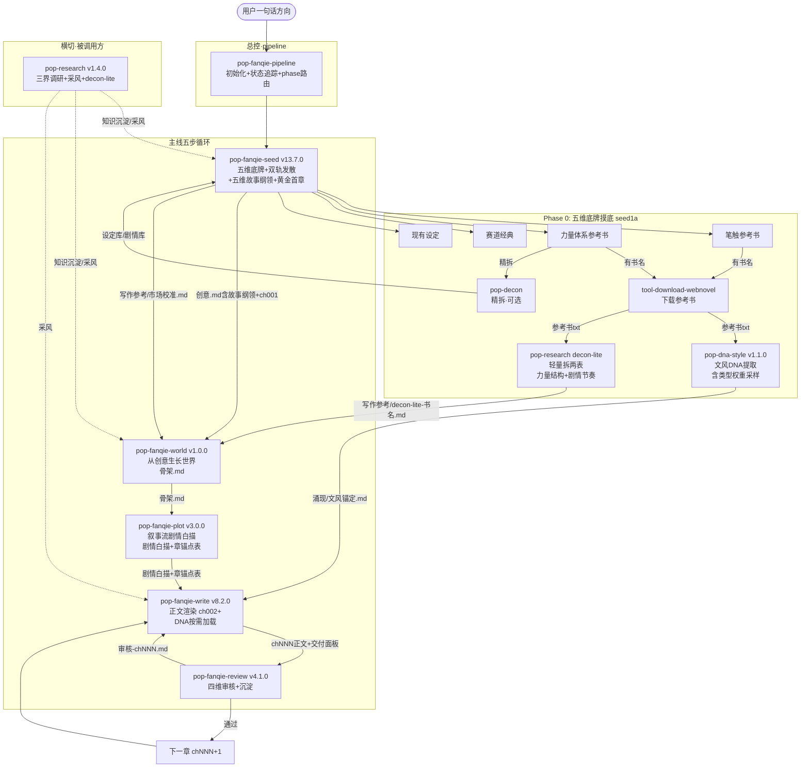

# 番茄 skill 群管线运行流程 PRD

> 版本：v1.4 | 日期：2026-07-21
> 对应 skill 版本快照：pipeline v2.1.0 / seed v13.7.0 / world v1.0.0 / plot v3.0.0 / write v8.2.0 / review v4.1.0 / dna-style v1.1.0 / research v1.4.0 / decon v20.0.0 / shared-dna v4.1.0 / download v7.0.0

---

## 1. 管线全貌

番茄 skill 群是一条从"用户一句话方向"到"可连载正文"的创作管线，由 11 个 skill 协作完成。总控是 **pop-fanqie-pipeline**（项目初始化 + project-state.md 状态追踪 + 6 个 phase 路由），主线是 seed → world → plot → write → review 的五章循环。seed 第一步是**五维底牌摸底**——一次性问清楚方向/笔触参考书/力量体系参考书/赛道经典/现有设定，缺的标缺不阻塞。力量体系参考书路由到 **pop-research decon-lite**（轻量拆书，只拆两表）；笔触参考书路由到 **pop-dna-style**（笔触 DNA 提取）。seed 发散阶段为**双轨**（王道赛道扫榜融合 5 个 + 猎奇赛道纯自由发散 5 个，共 10 个立项），落盘创意.md 时产出**五维故事纲领**（世界底色/危机基调/主角弧线/最大钩子/即时兑现感）。world 加载底牌，从创意**生长**世界（三源合流设计力量体系 → 驱动地图/势力/危机 → 第一卷弧线），产出骨架.md。plot 消费骨架.md，专注**叙事流剧情白描**（不碰设定设计）。write 的 DNA 加载从全文注入改为**按需加载**（通用维度全读 + 本章场景卡 1-3 张）。



seed 的 1a 不再是"问笔触参考书"一个维度，而是**五维底牌摸底表**——方向确定后，一次性问笔触参考书/力量体系参考书/赛道经典/现有设定/是否需要推荐。力量体系参考书路由到 pop-research 的 **decon-lite 档位**（轻量拆两表：力量体系结构+剧情节奏），笔触参考书仍走 download→dna-style。缺的标缺不阻塞。五维底牌全部就绪（或用户跳过）后，seed 进 1c 市场调研→1d 双轨发散（王道×猎奇各 5 个共 10 个立项）→1e 用户选→Step 2 结构化打磨（含**五维故事纲领**）→Step 3 黄金首章。

横切环节（图中虚线）的特点是"被调用方"：pop-research 不主动触发，由 seed / plot / write 在遇到信息缺口时按需调用，传入领域+具体问题+期望深度，执行完返回路径指针。

---

## 2. 各 skill 定位与边界

### 2.1 总控

| skill | 版本 | 定位 | 输入 | 产出 |
|:--|:--|:--|:--|:--|
| pop-fanqie-pipeline | v2.1.0 | 项目初始化+状态追踪+phase路由 | 项目名/当前目录 | `project-state.md`（管线地图） |

### 2.2 主线五章循环

| skill | 版本 | 定位 | 输入 | 产出 |
|:--|:--|:--|:--|:--|
| pop-fanqie-seed | v13.7.0 | 创意到首章 | 五维底牌摸底+用户一句话方向 | `0-立项/创意.md`（含五维故事纲领）+ `2-正文/ch001.md` + `写作参考/市场校准.md` |
| pop-fanqie-world | v1.0.0 | 从创意生长世界 | 创意.md + ch001 + market calibration + decon-lite（如有） | `1-骨架/骨架.md` |
| pop-fanqie-plot | v3.0.0 | 叙事流剧情白描 | 骨架.md + 创意.md + ch001 + 参考书DNA | `1-骨架/剧情白描.md` + `章锚点表.md` |
| pop-fanqie-write | v8.2.0 | 逐章渲染正文 | 剧情白描+骨架+current-state+前章+笔触DNA（按需加载） | `2-正文/chNNN.md`（2000-2500字）+交付面板 |
| pop-fanqie-review | v4.1.0 | 每章审核+沉淀 | chNNN正文+交付面板+剧情白描本章段 | `审核-chNNN.md`（四维审核+剧情沉淀） |

**边界纪律**：seed 只产创意+首章+故事纲领+市场校准，不碰世界构筑；world 只产骨架.md，不写白描；plot 只产白描+章锚点表，不碰设定设计，不写正文；write 只渲染不审稿；review 只审核不重写。每个 skill 的产出是下游的输入，不得越界。

### 2.3 前置供给环节

| skill | 版本 | 定位 | 何时调用 | 产出 |
|:--|:--|:--|:--|:--|
| tool-download-webnovel | v7.0.0 | 网文搜索下载 | 用户给出参考书名但无本地文件 | `downloads/{书名}.txt` |
| pop-dna-style | v1.1.0 | 文风 DNA 提取（笔触供给方） | 五维底牌摸底·笔触参考书 | `涌现/文风锚定.md`（笔触DNA，含类型权重采样）+ 可选 `涌现/剧情DNA-brief.md` |
| pop-research | v1.4.0 | 调研+decon-lite（被调用方） | 五维底牌摸底·力量体系参考书→decon-lite / seed/plot/write 信息缺口 | 三界框架知识沉淀 / 采风片段 / `写作参考/decon-lite-{书名}.md`（力量结构+剧情节奏两表） |
| pop-decon | v20.0.0 | 拆书精拆（可选） | 用户主动要求精拆一本书做立项圣经时 | `项目本地/设定库/`+`剧情库/`+`立项库/` |

**pop-dna-style 和 pop-decon 的边界**：两者读同一本参考书但粒度不同。decon 是重拆（8 维度全拆+Beat Sheet+全书剧情白描），用于精拆一本书做立项圣经；pop-dna-style 是轻采（笔触 DNA 必做+剧情 brief 可选），用于拿参考书当灵感源。产出路径也不同：decon 沉淀到项目本地 `设定库/剧情库/立项库/`，pop-dna-style 部署到项目本地 `涌现/文风锚定.md`。

**pop-research decon-lite 和 pop-decon 的边界**：decon-lite 是超轻量级——只拆两表（力量体系结构+剧情节奏）供 plot 三源合流，4 步完成（接收→拆两表→门禁→存盘）。完整 decon 是重拆（4 个 Phase），用户在五维摸底时选"精拆"才触发。两者共存：想快速拿力量体系参考→decon-lite，想做完整立项圣经→decon。

**pop-dna-style 和 pop-shared-dna 的边界**：pop-shared-dna v4.1.0 是老管线（pop-qidian-write 等）的文风 DNA 引擎，产出到 `写作资产/文风库/{书名}.md`；pop-dna-style v1.1.0 是番茄新管线的笔触 DNA 供给方，产出到 `涌现/文风锚定.md`。两者服务不同管线，共存不冲突。

---

## 3. 数据流转

### 3.1 主线数据流

```
pipeline（project-state.md 路由）→ seed 产出 → world 消费 → plot 消费 → write 消费 → review 消费 → write 消费（下一章）
```

| 产出文件 | 生产方 | 消费方 | 说明 |
|:--|:--|:--|:--|
| `project-state.md` | pipeline（初始化 + 每 phase 更新） | pipeline（每次对话路由）+ 所有 skill（上下文感知） | 管线唯一状态源。当前 phase / 五维底牌状态 / 创意摘要 / 最近产出 |
| `写作参考/市场校准.md` | seed（1c-4 落盘） | seed 1d（发散校验）/ world（赛道约束） | 借鉴点+避雷点+赛道格局。seed 发散事后校验，world 三源合流赛道参考 |
| `写作参考/decon-lite-{书名}.md` | pop-research（decon-lite） | world（三源合流第二源） | 力量体系结构+剧情节奏两表 |
| `0-立项/创意.md` | seed | world / plot | 创意方向+金手指+散文体简介+轻量主角轮廓+**五维故事纲领** |
| `2-正文/ch001.md` | seed | world / plot / write | 黄金首章试读章，write 从 ch002 开始 |
| `1-骨架/骨架.md` | world | plot / write | 世界从创意生长（三源合流→力量体系→地图→势力→危机）+第一卷弧线 |
| `1-骨架/剧情白描.md` | plot | write / review | **叙事流**整卷故事流（不是注水提纲），write 最关键输入 |
| `1-骨架/章锚点表.md` | plot | write | 章节顺序锁定，禁止跳章 |
| `2-正文/chNNN.md` | write | review | 2000-2500字正文+交付面板 |
| `审核-chNNN.md` | review | write（下一章） | 事件白描+主角变化五项+钩子追踪+下章建议 |

### 3.2 笔触 DNA 数据流（按需加载）

```
参考书 txt → pop-dna-style（类型权重采样）→ 涌现/文风锚定.md（全量DNA文件保持不动）
            → write 按本章场景类型定向消费（通用维度全读 + 本章场景卡 1-3 张 + 全书稳定特征）
```

DNA 加载从 v8.1.0 起从全文注入改为按需加载。DNA 保持全量文档不动，write 根据本章场景类型定向读取对应场景卡（对照表匹配），无关场景卡跳过不读。每个读入区块禁止 limit 参数截断。

write v8.2.0 的笔触层完全靠 DNA 驱动，自身只保留结构约束（章型骨架+字数+节奏物理量+爽感引擎）。

| 状态 | 条件 | write 行为 |
|:--|:--|:--|
| 启用态 | `涌现/文风锚定.md` 存在 | 笔触层从 DNA 取，禁止凭空发挥 |
| 缺失态 | `涌现/文风锚定.md` 不存在 | Step1 提示用户部署 DNA |
| trial 模式 | 用户拒绝部署 | 不内置默认风格，用户须显式声明基础风格 |

DNA 在 write 加载优先级排第一位，10 万字裁剪时也不裁剪。

### 3.3 调研数据流

```
seed/plot/write 遇到信息缺口
    → 调用 pop-research（传入领域+具体问题+期望深度）
    → pop-research 档位分流：三界框架 / 采风级 / decon-lite
    → 产出 写作参考/知识沉淀/{主题}.md 或 写作参考/decon-lite-{书名}.md
    → 返回路径指针给调用方
```

pop-research 支持 5 个期望深度档位：种子级（三界全量）/场景级（单界深入）/缺口级（定向补缺）/采风级（真实质感采集）/decon-lite（轻量拆两表）。decon-lite 跳过三界框架，直达拆书，供 plot 三源合流使用。

---

## 4. 理论运行流程

### 4.1 完整首次运行（含五维底牌摸底）

以下是一次完整首次运行的理论流程，从用户给出方向到写出第一章正文。pipeline 作为总控接管全程——agent 每次对话先读 `project-state.md` 知道当前 phase，按路由规则执行，每 phase 完成后更新 state。

**Phase 0：五维底牌摸底（seed 1a）**

管道接手用户方向后的第一步，seed 1a 弹出五维底牌摸底表，一次性问清楚：

| 底牌 | 用户回答 | seed 路由 | 产出 |
|:--|:--|:--|:--|
| 笔触参考书 | 有书名 | → tool-download-webnovel → pop-dna-style（类型权重采样） | `涌现/文风锚定.md` |
| 力量/体系参考书 | 有书名 | → tool-download-webnovel → **pop-research decon-lite**（只拆两表） | `写作参考/decon-lite-{书名}.md` |
| 力量/体系参考书 | 想精拆 | → tool-download-webnovel → pop-decon Phase 1-4 | `设定库/剧情库/立项库/` |
| 赛道经典 | 有书名 | → 记录到市场校准头部 | `写作参考/市场校准.md` |
| 现有设定 | 有设定 | → 记录到创意.md | 创意.md「九、用户预设设定」 |
| 没想好 | 需要推荐 | → pop-research 种子级调研→推荐书单→用户选 | 推荐书单 |

**不阻塞**：缺的底牌标缺，进 1b 闸门确认后放行。

**Phase 1：创意（seed，双轨发散 + 五维故事纲领）**

1. 五维底牌闸门（1b）：确认所有已有底牌就绪→放行
2. 市场调研（1c）：WebSearch 3 轮，产出借鉴点/避雷点清单→落盘 `写作参考/市场校准.md`
3. 双轨发散（1d）：
   - **A轨·王道赛道**：扫榜（番茄/起点 top 5-8）→提取可迁移核心卖点→5 种融合策略→产出 5 个方向
   - **B轨·猎奇赛道**：纯自由发散→产出 5 个方向
4. 双轨市场校准（1d-C）：用借鉴点/避雷点统合校验 10 个创意
5. 用户选定 1 个方向（1e）
6. 结构化打磨（Step 2）：行为引擎检查→合成金手指（创意×机制×限制）→四眼法验证→散文体简介→轻量主角轮廓
7. **五维故事纲领（2e）**：世界底色/危机基调/主角一生弧线/最大钩子/即时兑现感，≤500 字→落盘创意.md
8. 黄金首章（Step 3）：DNA 存在→从第 1 句用 DNA 笔触写（按需加载通用维度+首章场景卡）→ `2-正文/ch001.md`

**Phase 2：世界构筑（world v1.0.0，从创意生长）**

9. 加载底牌（Step 1-2 内化）：参考书 DNA（笔触+剧情 brief+decon-lite/decon）+ 创意.md（含故事纲领）+ 市场校准
10. 三源合流设计力量体系：赛道参考→参考书 DNA→创意.md 要素→力量层级表
11. 从力量体系生长地图/势力/危机：每项回溯创意.md 条款
12. 第一卷弧线（Step 3）：终点+幕序列（以对赌/升级难度为弧线核心）+高潮点+悬念分层
13. 落盘骨架.md（Step 4）：三件底牌+世界从创意生长+第一卷弧线

**Phase 3：叙事流剧情白描（plot v3.0.0）**

14. 加载骨架.md（Step 1 内化）：力量体系+地图+势力+危机+弧线→白描的世界地基
15. **叙事流剧情白描**（Step 2）：边走边讲，每段有画面/情绪/温度，标注信息差/伏笔/钩子。禁止"ch0XX 开头"
16. 落盘+章锚点表（Step 3）：剧情白描.md + 章锚点表.md

**Phase 4：正文渲染（write v8.2.0，从 ch002 开始，DNA 按需加载）**

17. 全文加载剧情白描+骨架+current-state+前章+设定库精选
18. 笔触 DNA 按需加载（通用维度全读 + 本章场景卡 1-3 张+全书稳定特征，无关场景卡跳过）
19. 选章型+章意图思考→写正文→篇幅检查→落盘+交付面板

**Phase 5：审核沉淀（review）**

20. 符合性检查+笔触检查+好看度 4 问+剧情沉淀→`审核-chNNN.md`
21. 通过→下一章；不通过→打回重写

### 4.2 稳态运行（章节循环）

首次运行完成后，进入稳态循环。每写一章走 Phase 4 + Phase 5：

```
ch002 → write → review → 通过？
                        ├─ 是 → ch003 → write → review → ...
                        └─ 否 → 打回 ch002 重写
```

稳态运行中，review 产出的 `审核-chNNN.md` 是下一章 write 的关键输入（事件白描+主角变化+钩子追踪+下章建议），确保连续性不断裂。

### 4.3 横切环节触发时机

| 横切环节 | 触发时机 | 典型场景 |
|:--|:--|:--|
| pop-research（种子级） | seed 五维摸底推荐书单 或 seed Phase 1 发散前 | 用户没想好参考书→调研同赛道热门推荐；或种子级世界观调研 |
| pop-research（decon-lite） | seed 五维摸底·力量体系参考书 | 用户有力量体系参考书→轻量拆两表供 world 三源合流 |
| pop-research（场景级） | world 世界构筑时 | 某个势力/场景需要深入调研 |
| pop-research（缺口级） | write 写作中 | 发现某个设定/规则信息缺口 |
| pop-research（采风级） | write 写作中 | 某职业/场景的真实质感缺口 |
| pop-dna-style | seed 五维摸底·笔触参考书 | 参考书下载完成后提取笔触 DNA（含类型权重采样） |
| pop-decon | seed 五维摸底（用户主动要求精拆时） | 用户想精拆一本书做立项圣经 |
| tool-download-webnovel | seed 五维摸底（有书名无本地文件） | 用户有参考书但无本地 txt |

---

## 5. 关键设计决策

### 5.0 plot v2.0.0 全量重构：从"填四张表"到"从创意生长"（核心改动）

项目 b 测试发现 plot 的世界构筑+剧情白描质量始终不行。三条根因：① 四张地图是"填空题"不是"建造题"——agent 填表产出"逻辑自洽但没灵魂"的世界（DND 等级模板套在命运卡牌系统上）；② 力量体系是通用模板套皮不是从创意长出来的；③ 剧情白描是"注水提纲"（"ch010，卡森动手了"这种工作笔记式写法）。

plot v2.0.0 全量重构 SOP：
- **三件底牌**（Step 1）：显式加载参考书 DNA + 创意（含故事纲领）+ 市场校准，缺的标缺不阻塞
- **从创意生长世界**（Step 2）：力量体系三源合流（赛道模式+参考书 DNA+创意.md 要素）→ 驱动地图/势力/危机，每项回溯创意.md 条款
- **叙事流剧情白描**（Step 4）：边走边讲，每段有画面/情绪/温度，禁止"ch0XX"章节号开头
- v2.0.1 修正：力量体系推导链从"金手指→"改为"三源合流"，危机从"四源"推导
- v2.1.0 修正：SKILL.md 内化 Step2 核心方法论
- v2.1.1 修正：step1 种子条款表新增故事纲领五维加载
- v3.0.0 拆分：设定设计移至 pop-fanqie-world v1.0.0，plot 瘦身为专注叙事创作（Step1加载骨架→Step2白描→Step3落盘）

### 5.1 五维故事纲领：seed 从配置项升级为有灵魂的立项文档（v13.6.0）

seed v13.3.0 的创意.md 太薄——只有配置项（创意/金手指/简介），plot 拿到只能填表。v13.6.0 在 Step 2 新增 2e·故事纲领——五维框架（世界底色/危机基调/主角一生弧线/最大钩子/即时兑现感），≤500 字。基于番茄/起点 8 本 top20 拆书验证，五个维度在 8/8 本书里全部在场。D 和 C 是内外互补关系：C 回答"这本书在讲什么"，D 回答"路人为什么停下来"。

### 5.2 DNA 按需加载 + 类型权重采样（write v8.1.0 + dna-style v1.1.0）

项目 c 测试发现：① agent 设 limit 参数导致 DNA 只读 37%（夜无疆 DNA 214 行只读 80 行）；② 全量注入 526 行诡舍 DNA 时无关场景卡稀释核心规则注意力。解法不是精简 DNA 丢样本，是保持全量文档不动+精准消费。

write v8.1.0：DNA 按需加载——通用维度全读+本章场景卡 1-3 张（对照表匹配）+全书稳定特征，无关场景卡跳过。新增场景卡加载对照表+禁止 limit 截断红线。

pop-dna-style v1.1.0：新增类型权重采样——恐怖悬疑重采揭秘/暗杀/情感高潮，战斗爽文重采 boss 战/群战，都市异能重采日常对话/揭秘/暗杀。核心场景采 3-4 章，边缘采 1-2 章。

### 5.3 双轨发散 + 五维底牌摸底 + decon-lite（seed v13.4.0/v13.7.0 + research v1.4.0）

纯自由发散全部偏向猎奇缺少王道选项→seed v13.4.0 拆为双轨（A 轨王道赛道扫榜融合 5 个 + B 轨猎奇赛道 5 个，共 10 个立项）。

seed 1a 只问笔触参考书但 plot 需要更多底牌→seed v13.7.0 升级为五维底牌摸底表。

完整 decon 太重（4 个 Phase）→pop-research v1.4.0 新增 decon-lite 档位：只拆两表（力量体系结构+剧情节奏），4 步完成。

### 5.4 decon 入库改本地沉淀（v20.0.0）

library 库已优化掉，decon 拆解产出直接沉淀到项目本地文件夹。不再需要入库确认步骤。

### 5.5 剧情白描是 plot 层核心

plot 投入 50% 注意力在剧情白描上。v2.0.0 起从模板推演法改为叙事流写法——边走边讲，每段有画面/情绪/温度。write 拿到的不只是"谁做了什么"，而是"这一段的温度是什么"。

---

## 6. 版本快照

| skill | 版本 | 核心改动 |
|:--|:--|:--|
| pop-fanqie-pipeline | v2.1.0 | 项目初始化+project-state.md 状态追踪+6 phase 路由（Phase 2拆为World+Plot） |
| pop-fanqie-seed | v13.7.0 | 五维底牌摸底+双轨发散+五维故事纲领+市场校准落盘+黄金首章（DNA 从 0 写） |
| pop-fanqie-world | v1.0.0 | 从创意生长世界（三源合流→力量体系→地图→势力→危机→第一卷弧线）→骨架.md |
| pop-fanqie-plot | v3.0.0 | 瘦身：加载骨架.md→叙事流剧情白描→章锚点表。设定设计移至world |
| pop-fanqie-write | v8.2.0 | 减法版+DNA 按需加载（场景卡对照表），禁止 limit 截断 |
| pop-fanqie-review | v4.1.0 | 四维审核，同步 write 笔触 DNA 一致性检查 |
| pop-dna-style | v1.1.0 | 笔触 DNA 供给方，双档位+类型权重采样（根据小说类型调整场景比例） |
| pop-research | v1.4.0 | 三界框架+采风+decon-lite（轻量拆两表供 plot 三源合流） |
| pop-decon | v20.0.0 | 精拆，入库改本地沉淀，decon-lite 替代日常轻重场景 |
| pop-shared-dna | v4.1.0 | 老管线文风 DNA 引擎，服务 pop-qidian-write |
| tool-download-webnovel | v7.0.0 | 三阶段 SOP，web 搜索兜底 |

---

## 7. 已知限制与待解决项

- **project-state.md 跨对话续接**：当前 project-state.md 落盘到项目本地，agent 每次对话需手动读取。平台层是否自动注入尚未对接
- **pipeline 路由依赖 agent 自觉**：pipeline 只定义了路由规则，但路由执行靠 agent 读 project-state.md 后自行判断。若 agent 跳过读 state 直接调 skill，路由规则将失效
- **DNA 按需加载的场景卡匹配依赖 agent 判断**：write 根据本章场景类型从对照表选取场景卡，但 agent 可能选错场景卡或漏选。对照表是手动生成的，非自动匹配
- **五维故事纲领→世界构筑的转化**：seed 产出的故事纲领是"500 字浓缩液"，plot 如何从 500 字精准展开为完整世界仍有 agent 执行偏差风险
- **decon-lite 采样范围局限性**：默认前 300 章采样，对超长篇（500+）的力量体系后期演变覆盖不全
- **DNA 融合**：想把多本书的文风 DNA 融合（如深渊主宰的数据看板+玄鉴仙族的笔触）尚未支持
- **对话趋同**：同一笔触 DNA 驱动不同剧情时，对话节奏可能趋同
