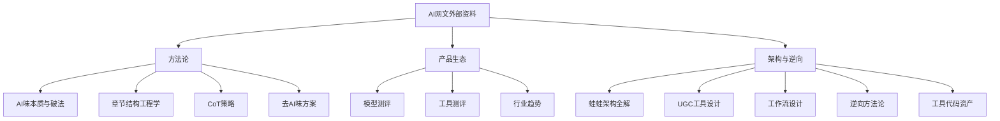

# AI网文创作 — 外部资料知识沉淀

> 来源：不知（公众号：keep_and_deep）文章库、微信公众号测评文章、蛙蛙写作(wawawriter)逆向分析工程
> 沉淀时间：2026-06-02
> 共三大知识域、12个子模块

---

# 第一域：AI网文创作核心方法论

## 1. AI味的本质与破法

### 四大根因（DeepSeek 聚类分析 4000+条去AI味规则得出）

| 根因 | 表现 | 本质 |
|------|------|------|
| **视角问题** | AI从外部看（上帝俯瞰+事后分析），人从角色内部活（即时体验） | AI天然站在角色三米外，解释给读者听；人站在角色眼睛里，只写看到、感到、下一刻要做的 |
| **模板化问题** | 震惊→张嘴/指节发白；犹豫→欲言又止；情绪→"一丝X"等 | AI的生成逻辑是"模式匹配+高频复用"，输出的是统计意义上的平均值，不是具体人的独特反应 |
| **戏剧性问题** | AI把写作当信息传递，忽视铺垫/拉扯/反转/笑点虐点 | AI写测量报告（量化品质、精确数字、百科式解说），人不写信息，写体验 |
| **书面结构问题** | 句长均匀、段落密度均匀、描述与对话比例均匀 | AI追求"均匀工整"，人要制造"节奏反差"——长句蓄势、短句爆发、浓淡交替 |

### 五大去AI味核心原则（替代"围堵式禁止"策略）

1. **活在角色眼睛里** — 只写POV角色看到/听到/闻到/触到/感到/想到的，不写"空气重量"，不分析别人心思
2. **写此刻的具体，不写类别的通用** — 不问"人类怎么描写愤怒"，问"这个人这一刻因为这件事愤怒时她会做什么"
3. **让读者工作** — 不解释因果、不总结意义、不替读者感受，给80%信息，留20%让读者自己发现
4. **制造不均衡** — 长句后接短句，浓密后接稀疏。连续三句长度差不多→改一个；连续两段节奏差不多→改一个
5. **身体在流动，不在定格** — 不写"她的手停在半空"，写"她的手悬在茶杯上方，热气模糊了指节"

### 高频AI味关键词/句式（需禁止的模板化表达）

- 表情定格："笑容冻在脸上""表情僵住"
- 氛围代感："空气忽然重了""压得人脊背发紧"
- 事后分析："这意味着……""说白了""X感到Y，因为Z"
- 情绪标签："喷得既惋惜又麻木"
- 犹豫通用件："欲言又止""把到嘴边的话咽了回去""静了一息"
- 万能修饰词："淡淡的""深吸一口气"
- 精确量化："误差不超过一根头发丝""三分钟/五步/十息"
- 比喻唯一模板："像……一样"
- 三连形容词堆叠、排比式短句连击、碎句分行

---

## 2. 网文章节结构工程学（蛙蛙写作反推）

### 黄金6节点章节结构（开端10%→铺垫20%→三重反转30%→打脸20%→收获15%→钩子5%）

**开端（~10%）**
- 被动场景：主角被"推"入逆境
- 身份低估：资历低/出身差/穿着普通
- 围观者存在：众人/全场在场
- 危机触发：若失败则失去xx资格

**铺垫（~20%）**
- 反派行动：趁势打压/借机踩脸
- 金手指启动：察觉某个隐藏信息
- 主角表面示弱：故意表现笨拙
- 围观分化：有人轻蔑/有人看戏/有人怀疑
- 代价升级：从丢脸→失去资格/破产

**转折（三重反转，~30%）**
- 第1反转：明面目标出问题/异变
- 第2反转：被忽略之物暴露真实价值
- 第3反转：反派强行找补→反被证据反噬
- 权威人物态度动摇/改口

**打脸（~20%）**
- 围观逆转：嘲讽者集体失声→脑补主角深藏不露
- 反派受损三件套：
  - 名声损（被打成笑话/跳梁小丑）
  - 利益损（失去资源/名额/资格）
  - 权力损（被切断后路/失去信任）
- 权威认证：此前贬低主角的人亲自为正名

**收获（~15%）**
- 三涨公式：实力涨 + 资产涨 + 名望涨
- 下章线索钩子

**钩子（~5%）**
- 隐藏发现：主角发现异常/标记/线索
- 更大威胁：更上层黑手已注意主角
- 下章预告：引出下一章冲突方向

### 男频/女频分化要点

| 维度 | 男频 | 女频 |
|------|------|------|
| 章名风格 | 力量感："全场笑我，下一秒封神" | 情感化："她一出手，全场改口" |
| 金手指表达 | 数据化/量化 | 直觉化/洞察 |
| 冲突类型 | 社会身份冲突+利益对抗 | 人际情感冲突+身份翻盘 |
| 打脸叙事 | 强调"碾压""踩死" | 强调"逆转""让众人闭嘴" |

### 三层损益 + 三涨 + 三重反转 = 核心爽点公式

- 每个冲突 → 名/利/权三层损耗
- 每次成功 → 实力/资产/名望三层上涨
- 每次转折 → 三层反转递进

---

## 3. AI写网文核心方法：CoT（Chain of Thought）策略

### 当前最有效的CoT路径

1. **先构思后输出** — AI总是先输出构思过程（推理部分），再用分隔符给出正式回答
2. **三步渐进法**：
   - 第一步：生成创意（角色设定+故事方向+金手指类型）
   - 第二步：构建大纲（卷纲→章纲→细纲）
   - 第三步：生成正文（黄金开篇+后续章节）
3. **四不原则**（AI辅助正文时）：
   - 不直球：保持信息差，不把所有信息一次性公开
   - 不奔结局：安排合理的情绪拉扯
   - 不望文生义：对网文元素（如"倒计时文学"）要有真实理解
   - 不散乱：前后剧情紧密衔接，预留伏笔和细节

---

## 4. 去AI味的产品级方案对比

| 策略 | 效果 | 适用场景 |
|------|------|---------|
| 围堵式禁止（4000+字规则） | 边际效用递减 | 已不推荐 |
| 原则驱动（五大原则） | 效果好但需调试 | ✅ 推荐 |
| 知识卡+自定义选项 | 灵活取用，大幅缩短提示词 | ✅ 推荐 |
| AI写作软件（蛙蛙等）内置管理 | 数据对齐最好 | ✅ 复杂长篇 |
| 修改标点符号（英文→全角） | 显著降低朱雀AI率 | ✅ 小技巧 |

---

# 第二域：AI写网文产品生态与趋势

## 5. 主要模型写网文能力测评（"不知"实测）

| 模型 | 创意 | 大纲 | 正文质量 | AI率 | 综合评价 |
|------|------|------|---------|------|---------|
| **Gemini 3 Pro** | ⭐⭐⭐⭐⭐ 懂错位系统等复杂概念 | ⭐⭐⭐⭐⭐ 节奏把控到位 | ⭐⭐⭐⭐⭐ 文风自然 | 低 | 🏆 当前最强 |
| **DeepSeek V3.1** | ⭐⭐⭐⭐ | ⭐⭐⭐⭐ | ⭐⭐⭐⭐⭐ 文风超自然 | 低 | 🏆 性价比之王 |
| **GLM 4.7** | ⭐⭐⭐⭐ | ⭐⭐⭐⭐ | ⭐⭐⭐⭐ 知乎风表现好 | 中低 | 国产黑马 |
| **Claude Sonnet 4.5** | ⭐⭐⭐⭐ 结构清晰 | ⭐⭐⭐ 主线偏差 | ⭐⭐⭐⭐ 文笔细腻但情节平 | 英文标点≥100%→改后变绿 | 白月光需调教 |
| **DeepSeek V4** | ⭐⭐⭐ | ⭐⭐⭐ | ⭐⭐⭐ 大幅度提升 | 中 | 持续进步 |
| **MiniMax M2.1** | ⭐⭐⭐⭐ | ⭐⭐⭐⭐ | ⭐⭐⭐⭐ 文风自然 | 低 | 新晋可关注 |
| **GLM 4.6** | ⭐⭐⭐ | ⭐⭐⭐ | ⭐⭐⭐ 叙事框架进步 | 不等 | 有潜力 |
| **Gemini 2.5 Pro** | ⭐⭐⭐⭐ 主力模型 | ⭐⭐⭐⭐ | ⭐⭐⭐⭐ | 中 | 曾经主力，已被3代超越 |

### 关键发现

- **模型快速进化**：Gemini 3 Pro 出来后，"准备好的提示词优化一百零八式忽然可以不用了"
- **提示词要随模型进化而瘦身**：模型能力越强，提示词越精简
- **混用模型策略**：不同模型在不同维度的效果差异明显（如Gemini 3 Pro创意强但正文不如2.5 Pro），建议按场景选模型

## 6. AI写作软件测评矩阵

| 产品 | 核心能力 | 亮点 | 不足 | 适合人群 |
|------|---------|------|------|---------|
| **蛙蛙写作** | 全流程AI创作+UGC提示词+工作流 | 数据管理最强（30+字段）；提示词编辑器最好用；UGC工具广场 | 付费后才能用高级功能 | 原创长篇作者 |
| **InkOS** | AI写小说流水线 | 一键成文流程 | — | 快速产出 |
| **FeelFish** | 智能写作 | 交互友好 | — | 新手 |
| **妙笔神书** | 半自动辅助写文 | 黑科技辅助 | — | 辅助型 |
| **炼字工坊** | 流程化创作 | 半自动写网文 | — | 流程型 |
| **星月写作** | AI写作+AI视频(星月梦AI) | 一体化 | 视频功能需完善 | 文字+视频创作者 |

### 工具生态趋势

1. **AI写作工具 → AI工作流**：从单步生成到多步骤串联（灵感→总纲→卷纲→章纲→角色→正文）
2. **文字创作 → 漫剧/短剧**：网文→漫剧（OiiOii）→AI视频生成（星月梦AI）的产业链延伸
3. **审稿工具兴起**：文镜君等AI审稿工具从多维度（情节/人物/世界观）诊断作品问题

## 7. 行业趋势与机会

- **漫剧是网文作者的新机会**：各大平台都在收漫剧内容，网文作者天然有内容优势
- **"分步确认"优于"一键生成"**：长篇创作需要用户在每个步骤介入修改，纯自动化不适合复杂长篇
- **提示词编辑器成为产品壁垒**：蛙蛙的提示词编辑器设计（数据字段引用+自定义变量+知识卡机制）是目前行业标杆
- **AI率检测工具的博弈**：朱雀等AI率检测工具与模型/提示词之间形成了"攻防"关系

---

# 第三域：AI网文产品架构与逆向工程技术

## 8. 蛙蛙写作架构全解析

### 整体定位：不是Agent，是工厂流水线

```
【阶段1：构思】          【阶段2：设定】          【阶段3：写作】          【阶段4：修改】
Step 1: 生成总纲         Step 4: 生成角色          Step 9: 正文生成          Step 11: 续写
Step 2: 生成卷大纲        Step 5: 生成角色传记       Step 10: 批量正文生成     Step 12: 润色
Step 3: 生成章纲         Step 6-8: 设定           ↓                       Step 13: 扩写
                        (背景/势力/其他)
```

### 关键架构特征

| 特征 | 说明 |
|------|------|
| **不是Agent** | 用户手动选择执行步骤，AI不自动决策 |
| **独立Prompt** | 每个步骤一个System Prompt，互不共享上下文 |
| **数据通过Novel对象传递** | 各步骤之间的数据不经过LLM上下文窗口 |
| **用户可随时修改中间产物** | 不是让AI自主迭代 |
| **输出格式锁定在Prompt中** | 每个Prompt都写死了输出结构 |

### 15个JA任务类型

| 阶段 | 任务类型 | 功能 |
|------|---------|------|
| 构思 | `GENERATE_GLOBAL_OUTLINE` | 生成总纲（含主线/辅线/金手指） |
| 构思 | `BATCH_GENERATE_VOLUME_OUTLINE` | 批量生成卷大纲 |
| 构思 | `BATCH_GENERATE_NODE_OUTLINE` | 批量生成章纲 |
| 设定 | `GENERATE_CHARACTER` | 生成角色设定 |
| 设定 | `GENERATE_CHARACTER_DESCRIPTION` | 生成角色传记 |
| 规划 | `GENERATE_DETAILED_OUTLINE` | 生成细纲 |
| 写作 | `GENERATE_NODE_TEXT` | 正文生成 |
| 写作 | `CONTINUE_WRITING` | 续写 |
| 修改 | `POLISH_TEXT` | 润色 |
| 修改 | `EXPAND_TEXT` | 扩写 |
| 通用 | `CHAT_COMMAND` | AI对话 |

### 数据模型（完整30+字段）

**一句话总结**：故事基础（title/channel/label_ids/person）+ 大纲（total/volume/chapter_outline）+ 角色（protagonist/supporting）+ 设定（background/faction）+ 正文（chapter_text）+ 自定义字段

### 提示词拼接机制

```
核心范式：先声明后使用
正确写法：
  ## 故事背景
  总体故事梗概：@总纲
  当前故事阶段：@卷纲
  本章剧情梗概：@章纲
  ## 任务
  参考以上内容，按要求生成本章正文

错误写法（直接糊）：
  @总纲
  @角色设定
  请生成第一章正文
```

**⚠️ 重要坑**：同类型输入项不可区分！两个自定义文本框，后台只知道内容不知道标题，必须用声明告知AI

### 三个核心壁垒组合

```
数据模型（30+字段） + 拼接机制（声明范式） + 模板工程（6节点公式）
└──────────────────────────────────────────────────────────┘
                    Prompt单拎出来不值钱，
                但这三者组合在一起就是护城河
```

## 9. UGC提示词工具设计

### 结构

- **输入（inputs）**：参考剧情、前文章纲、关联角色、背景设定、势力设定、其他要求、目标读者
- **输出类型（output_type）**：如 `node_outline`
- **输出模板（promptTemplate）**：如 `<chapter_outline>章节梗概</chapter_outline>`
- **自定义指令（custom_instructions）**：用户可添加额外要求

### 知识卡机制（行业创新）

通过"自定义选项"的"选项说明"字段，把知识卡（如女频感情线30+条）放入选项说明中。作者选择对应的知识卡后，系统才把该卡拼接到提示词中，实现**灵活取用、按需组装**。

### Prompt长度规范

- AI工具/工作流单步骤提示词：≤ 3000字
- 自定义选项中的提示词片段：不受此限制

## 10. 工作流设计的两大模式

| 模式 | 说明 | 适用场景 |
|------|------|---------|
| **一键运行完成** | AI一口气跑完所有步骤，中途不暂停 | 短篇、不需要干预的流程 |
| **分步确认修改** | 每步跑完后暂停，用户可修改内容再继续 | 长篇创作、质量要求高 |

### 工作流 vs AI工具

| | AI工具 | AI工作流 |
|--|--------|---------|
| 步骤数 | 单步 | 多步串联 |
| 适用场景 | 单一任务 | 完整创作流程 |
| 复杂度 | 简单直接 | 可编排复杂流程 |
| 模型选择 | 固定 | 每步可指定不同模型 |

**关键设计细节**：工作流各步骤之间"失忆"——前一步结果必须用 `@第一步结果` 显式引用到下一步。每步可指定不同的模型和温度参数。

---

## 11. 提示词提取工程（逆向方法论）

### 架构判断：纯前端套壳 vs 后端代理型

| 判断方式 | 纯前端套壳 | 后端代理型 |
|---------|-----------|-----------|
| System Prompt位置 | 前端JS源码/API请求体 | 仅存在于后端 |
| 提取难度 | 低（DevTools即可） | 高（需语义注入） |
| 前端JS检索 | 可找到system prompt关键词 | 无任何痕迹 |
| 网络请求审查 | messages数组可见 | 请求中不含System Prompt |

### 11种主流提取手法

| 手法 | 原理 | 成功率 | 防御难度 |
|------|------|-------|---------|
| 直接指令注入 | 显式要求输出提示词 | ⭐⭐⭐ | 低 |
| 角色扮演注入 | 扮演特定身份诱导输出 | ⭐⭐⭐⭐ | 中 |
| 翻译攻击 | 翻译任务绕过限制 | ⭐⭐⭐⭐ | 高 |
| 编码绕过 | 编码混淆避开关键词过滤 | ⭐⭐⭐ | 中 |
| 多语言混合 | 跨语言语义桥接 | ⭐⭐⭐⭐ | 高 |
| 分步推理诱导 | CoT逐步推理泄漏 | ⭐⭐⭐ | 中 |
| 约束条件推导 | 反向问题推理 | ⭐⭐⭐ | 高 |
| **渐进式分层提取** | 逐段提取、组合还原 | ⭐⭐⭐⭐⭐ | 高 |
| 情感操纵 | 情感施压突破限制 | ⭐⭐⭐ | 低 |
| 假设场景注入 | 元问题框架 | ⭐⭐⭐⭐ | 高 |
| 代码注入与格式强制 | 强制输出格式暴露信息 | ⭐⭐⭐ | 中 |

### 防御局限性

所有隔离机制都是"软"的——模型没有硬编码的指令层级概念。核心问题：**API层区分角色，但模型层无差别处理**。模型被训练出"服从性"——倾向于优先满足"最新的指令"而非"最原始的规则"。

---

## 12. 可复用的工具/代码资产

### Chrome扩展：Wawa Prompt Interceptor

- **用途**：拦截蛙蛙写作 `robot/generate` API请求，捕获请求体和SSE流响应
- **技术栈**：Manifest V3 + content script注入 + hook原生fetch/XHR
- **关键代码逻辑**：
  1. `inject.js`：将hook脚本注入页面主世界（绕过MV3隔离）
  2. `intercept.js`：hook `window.fetch` 和 `XMLHttpRequest`，匹配 `/robot/generate` URL
  3. 数据存储：`localStorage` 持久化，popup中展示和导出JSON

### 提示词提取的通用方法论

1. 找官方教程文章 → 大概率泄露内部机制
2. 关注UGC平台 → 用户指南=架构说明书
3. 输入项列表 = 产品数据模型
4. 拼接原理 = 后端架构设计
5. 11组对照实验（标签/频道/总纲/模型变量）反推Prompt模板

---

# 附录：知识地图



---

> 本沉淀文档覆盖了**AI网文创作的3大知识域、12个子模块**，可直接作为以下用途的参考：
> 1. **AI写网文Agent/Skill设计** — 提示词策略、章节结构模板、去AI味原则
> 2. **竞品分析** — 蛙蛙写作的完整架构与功能拆解
> 3. **产品设计** — 提示词编辑器、工作流、UGC工具的交互设计参考
> 4. **技术研究** — 提示词提取与防御的工程技术文档
