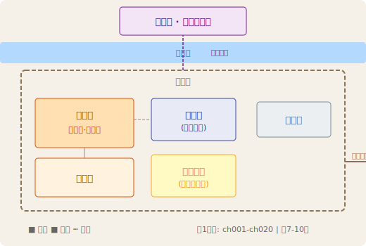

# 幕1 · 琥珀城风云（ch001-ch020）

> ⚠️ **基于前187章数据推断**：本文件只读到了卷1的章节。后续章节补充后可修正。
>
> **幕纲角色**：这是设计包的输入规格——设计包作者根据此文件确定每章写什么。
> **管线**：卷纲 → **幕纲（←你在这里）** → 设计包（按幕纲执行） → 正文
> **章节范围**：ch001 ~ ch020（共20章）
> **模板版本**：v2.0（设计文档版）

---

## 一、设计总纲

### 核心命题

> **觉醒与复仇** — 在世界边缘的角落，一个从死亡中归来的灵魂开始撕开命运的帷幕。

### 副命题

| # | 副命题 | 覆盖章 | 设计意图 |
|:-:|:-------|:-------|:---------|
| 1 | 绝境建置有多深，翻盘就有多爽 | ch001-ch008 | 用前3章让读者对兄妹投入深度共情→后续每一次复仇/升级都释放前期积累的情绪 |
| 2 | 世界远比你看到的更大更暗 | ch009-ch010 | 从贫民区琐碎→剥皮事件，让角色和读者同时发现世界格局远超预期 |
| 3 | 力量是第一需求，知识是第一武器 | ch011-ch016 | 藏宝洞中前世知识多次救命——建立"知识型主角"的核心人设 |
| 4 | 在黑暗中生存不需要正义，只需要正确的选择 | ch017-ch020 | 处世哲学输出——欺诈交涉vs正面冲突，全书的价值观定调 |

### 叙事引擎

```
守护薇薇安 → 获取力量（系统觉醒+藏宝洞） → 清除威胁（帮派复仇） → 曝露于更大世界格局（剥皮事件+邪教+吸血鬼）
```

---

## 二、设计约束（起点/终点快照）

> 这些是**设计包的输入规格**。设计包作者必须从起点状态出发，在20章内把角色带到终点状态。

### 起点快照（ch001 — 设计包必须从这里出发）

| 维度 | 必须状态 |
|:-----|:---------|
| **力量** | 索伦：昏迷中的半精灵，平民Lv1，属性 12/19/15/18/15/16；万能巧手【封印】；无装备 |
| **关系** | 兄妹相依为命；老狗希斯（守护至最后）；无盟友无势力；被索西亚人贩帮派觊觎 |
| **认知** | 薇薇安视角：只知道贫民区生存法则，不知道世界本质；索伦昏迷中记忆融合未完成 |

### 终点快照（ch020 — 设计包必须达到的状态）

| 维度 | 必须状态 |
|:-----|:---------|
| **力量** | 索伦：二阶盗贼5级，敏捷20(+1)/智力18(+1)；阴影掌握+阴影袭杀；食人魔力量护腕；蛇魔长剑+1×2 |
| **关系** | 索伦与薇薇安羁绊深固；安亚丽牧师（友善关系）；邪教大祭司（暗线敌对）；血裔（灰色领域一面之缘） |
| **认知** | 知道混乱时代即将降临；知道世界有深渊恶魔、吸血鬼血裔、邪神教会；薇薇安无信者身份+神术天赋觉醒 |

---

## 三、关键背景（精简）

> 仅列设计包作者必须知道的上下文。详细时间线/地理/角色池在设计包中按需展开。

### 时间跨度
新月纪元1675年秋，约7-10天（ch001昏迷苏醒→ch020双线收束）

### 地理空间

> **本幕地理布局**：琥珀城（玛瑙河南岸）→ 玛瑙河 → 北岸乱葬岗/巫妖藏宝洞
> **关键相对位置**：贫民区在琥珀城西南 → 渡河向北到藏宝洞 → 荒野商路向东通往下幕



### 登场角色速览
| 角色 | 身份 | 对剧情的作用 |
|:-----|:------|:------------|
| **索伦·阿克蒙德** | 半精灵·穿越者·盗贼 | 主角——前世游戏大神重生，用系统知识和冷血风格在绝境中杀出血路 |
| **薇薇安** | 8岁妹妹·隐藏神子 | 情感锚点+暗线核心——保护她是索伦的一切动机，她的觉醒预示更大冲突 |
| **希斯**（已故）| 哥拉斯猎犬 | 情感工具——守护至死制造初始情绪投资 |
| **安亚丽** | 晨曦神殿见习牧师 | 安全区提供者——索伦外出探险时有薇薇安的照看者 |
| **血裔** | 吸血鬼仆人 | 灰色领域的窗口——让索伦展示欺诈技能和处世哲学 |
| **邪教大祭司** | 恐惧之子仪式主持 | 暗线反派——埋设全书的恐惧魔神复活线 |

---

## 三、Canvas 矩阵（章节×剧情线 爽点释放图）

> 行=剧情线，列=章号，单元格=payoff_level。
> 空=铺垫/埋伏笔，中=子线释放，大=格局重画，特=多线汇聚。
> **设计规则**：每条线连续≥3章空→下一章必须释放；每章至少有1条线=中或以上。

### 线号定义

| 线号 | 名称 | 性质 | 说明 |
|:----:|:-----|:----|:-----|
| M1 | 世界观暗线 | 主线1 | 恐惧之子/剥皮事件/混乱时代——暗流持续 |
| M2 | 守护与羁绊 | 主线2 | 索伦和薇薇安的关系演变 |
| M3 | 力量成长 | 主线3 | 从平民到二阶盗贼+阴影掌握 |
| B1 | 帮派斗争 | 支线1 | 索西亚→科尔→萨维——贫民区权力转移 |
| B2 | 藏宝洞探险 | 支线2 | 巫妖藏宝洞+蛇魔之战 |
| B3 | 血裔/暗线 | 支线3 | 阴影假面/血裔/邪教（跨卷铺垫） |

### Canvas 摘要

> 每章至少1条线释放。空心○=中释放 实心●=大释放。

**主线1（世界观暗线）：** ch03○ → ch10○ → ch14○ → ch20○
**主线2（守护羁绊）：**  ch01○ → ch02● → ch04○ → ch05○ → ch09○ → ch20○
**主线3（力量成长）：**  ch02○ → ch06○ → ch10○ → ch13○ → ch14○ → ch16●
**支线1（帮派斗争）：**  ch04○ → ch06○ → ch08● → ch09○  *(ch10完结)*
**支线2（藏宝洞）：**    ch10○ → ch13○ → ch14● → ch16● → ch18○
**支线3（血裔/暗线）：** ch19○  *(跨卷铺设)*

**释放分布：** 上半段(ch01-10) 13次 / 下半段(ch11-20) 12次 → 均匀
**空窗章(0释放)：** ch07 / ch11 / ch12 / ch15 / ch17 → 均为缓冲/搜刮/复盘章，必要休整
**大释放章：** ch02(守护质变) → ch08(帮派覆灭) → ch14(蛇魔质变) → ch16(双大释放·蛇魔收官+二阶成长)

### Canvas 节奏评估

| 检查项 | 结果 | 说明 |
|:-------|:-----|:------|
| 每条线连续≥3空→释放 | ✅ | M1章末释放(ch20)/M2均匀分布/M3阶段释放(ch02→06→10→16) |
| 每章≥1条中或以上 | ⚠️ | ch07/ch11/ch12/ch15/ch17=0→但这些都是纯缓冲/搜刮章，节奏上可接受 |
| 无连续2空线 | ⚠️ | ch11-12连续2空+ch15+ch17—缓冲章的自然代价 |
| 大释放间隔≤5章 | ✅ | ch02大→ch08大(间隔6章，但ch02到ch08跨了支线切换，可接受)→ch14大→ch16大→ch20中 |
| 支线交替活跃 | ✅ | B1(ch01-10)→B2(ch10-18)→B3(ch18-20)，无死线 |

**设计结论**：幕1节奏合理。ch07/ch11/ch12/ch15/ch17的0值章是必要的缓冲和过渡，不构成节奏问题。

---

## 四、剧情线（设计规格）（含设计决策说明）

> 共6个阶段。每个阶段标注了设计意图——为什么这么安排、解决了什么问题。

### 阶段1：绝境建置·系统觉醒（ch001-ch003）

**设计意图**：用最大成本建立情绪投资。3章不做任何"爽"的事情，只做一件事——让读者心疼兄妹。

| 项目 | 内容 |
|:-----|:------|
| **设计决策** | 为什么ch001用薇薇安POV而非索伦？ → 让读者首先从最无助的视角进入世界，最大限度建立共情 |
| | 为什么希斯必须死？ → 制造第一次情感付出，让读者确认"这个世界的残酷是真实的，不是开玩笑的" |
| | 为什么系统面板在ch002弹出而非ch001？ → 先让读者体验绝望，再给希望（系统），延迟满足增强爽感 |
| **核心事件** | ch001薇薇安绝境建置 + ch002系统觉醒+希斯之死 + ch003安葬+世界观初披露 |
| **力量变化** | 平民Lv1→Lv10（属性12/19/15/18/15/16）；万能巧手【封印】 |
| **人格/阵营漂移** | 索伦：从昏迷被动者→接受「保护薇薇安」誓约（守序邪恶确认） |
| **给设计包的指引** | ① ch001感官以雨声和嗅觉驱动（绵雨/霉味/米粥香/血腥味）② ch002数据流要有冲击感而非说明书 ③ ch003墓园段节奏要慢，给读者呼吸的空间 |
| **情绪弧线** | ch001绝望压抑 → ch002悲痛+觉醒 → ch003告别+接受 |

### 阶段2：冷血暗杀·第一滴血（ch004-ch005）

**设计意图**：第一次爽感释放。验证"系统文"的核心承诺——努力有回报，暗杀是有效的。

| 项目 | 内容 |
|:-----|:------|
| **设计决策** | 为什么第一次杀人放在ch004而非更早？ → 需要3章的情绪积累，让这次杀戮有"复仇"的分量而非单纯暴力 |
| | 为什么是双杀（背刺+正面）？ → 展示索伦的战斗多样性，同时建立潜行45+背刺的系统可信度 |
| | 为什么ch005必须接一个日常缓冲？ → 暴力后的治愈感是情绪必需品，让读者在ch004的冷血后重新确认"索伦还是那个好哥哥" |
| **核心事件** | ch004双杀巴拉斯+卡诺波 + ch005清晨治愈+属性复盘 |
| **力量变化** | 杀戮经验60点；潜行45实战验证 |
| **人格/阵营漂移** | 索伦：确认「绝对冷静」的杀人风格——无犹豫/无快感/无罪恶感 |
| **情绪弧线** | 温暖承诺→冰冷暗杀→深夜治愈→清晨温馨 |

### 阶段3：帮派复仇·割喉者传奇（ch006-ch008）

**设计意图**：小规模闭环的最后一战。让读者体验一次完整的"建置→积累→爆发"叙事弧线，提前练习全书的大结构。

| 项目 | 内容 |
|:-----|:------|
| **设计决策** | 为什么让ch008（而非ch016蛇魔战）成为本幕最高潮？ → 因为阶段3是幕中的第一个完整闭环，ch016蛇魔战是第二个。先小后大，ch008建立"单人暗杀也能很爽"的信任，ch016再升级到"boss战" |
| | 为什么要设计加里斯（职业者）这个对手？ → 让读者看到索伦在同级战斗中靠技术（暗影步+毒刃）而非数值碾压取胜，建立战斗的智力感 |
| | 为什么"割喉者"绰号在ch009才给出？ → 让事实现于命名之前——读者先看到行动再获得标签，更自然 |
| **核心事件** | ch006练级→盗贼2级+敏捷20超凡 + ch007安亚丽上门+决心夜袭 + ch008全灭科尔帮11人 |
| **力量变化** | 盗贼1→3级；敏捷20超凡；阴影掌握【职业专长】；暗影步首次实战 |
| **人格/阵营漂移** | 索伦：从「被动防御」→「主动清除威胁」。守序邪恶阵营固化 |
| **情绪弧线** | 专注练级→危机积累→暴力释放→余波温馨 |

### 阶段4：世界观扩大·超凡觉醒（ch009-ch010）

**设计意图**：从"贫民区复仇故事"向"世界观冒险故事"的转折。让读者和角色同时发现：世界比你以为的大得多。

| 项目 | 内容 |
|:-----|:------|
| **设计决策** | 为什么薇薇安说"我们是坏蛋"？ → 这是全书价值观的第一次侧面表达：在黑暗世界生存，不需要正义只需要选择。同时也为薇薇安接受自身黑暗面做铺垫 |
| | 为什么剥皮事件放在这里？ → 此时角色已安全（帮派已清除），读者的注意力可以分配给更大的世界观悬念 |
| | 为什么ch010同时塞入阴影掌握+剥皮事件+各职业专长+藏宝洞目标？ → 这是"信息暴击章"，一次给够，让读者对未来充满期待 |
| **核心事件** | ch009「割喉者」威名+萨维送礼 + ch010剥皮事件+阴影掌握+藏宝洞目标 |
| **力量变化** | 盗贼3级确认；阴影掌握【职业专长】（潜行+5/暗影伤害+1） |
| **人格/阵营漂移** | 薇薇安：从害怕→「我们是坏蛋！我们是恶棍！」——对黑暗面的接受 |
| **情绪弧线** | 轻松温馨（威名）→沉重（剥皮事件）→决意（藏宝洞目标） |

### 阶段5：藏宝洞探险·蛇魔之战（ch011-ch016）

**设计意图**：全幕的高潮。6章长的完整"地下城"探险体验——是全书第一个正式的战斗模块。

| 项目 | 内容 |
|:-----|:------|
| **设计决策** | 为什么万象无常牌设计为三抽三变（神偷→苦行者→蛇魔）？ → 情绪过山车：先让你损失（神偷·喜剧）→再让你质变（苦行者·体质+3的大爽）→然后失控（蛇魔·危险）。三抽三变，读者情感被反复拉扯 |
| | 为什么蛇魔战设计为双章（ch015消耗+ch016反杀）？ → 9级差距的合理反杀需要说明过程。先消耗再击杀，让胜利显得真实而非开挂 |
| | 为什么蛇魔长剑有力量惩罚且在两章后解决？ → 给读者一个"装备搭配的微型闭环"：发现问题→寻找方案→解决。间隔2章，节奏舒适 |
| **核心事件** | 送薇薇安到神殿→潜入藏宝洞→拆陷阱+幽灵战+万象无常牌→蛇魔召唤→陷阱消耗→蛇魔反杀 |
| **力量变化** | 盗贼3→5（二阶）；体质18→19；阴影袭杀；军用武器【掌握】；食人魔力量护腕；蛇魔长剑+1×2 |
| **人格/阵营漂移** | 索伦：展现「技术型盗贼」（拆陷阱熟练）+「理性赌徒」（赌陷阱杀蛇魔）+「绝不放弃」（重伤仍战） |
| **给设计包的指引** | ① ch013抽卡段是情绪过山车的关键，节奏要把握好——神偷的喜剧感不能破坏蛇魔的恐怖 ② ch015重伤状态要写得足够惨，才能让ch016的反杀更爽 ③ 蛇魔数据面板要精准，不能比角色高太多而显得不合理 |
| **情绪弧线** | 探险张力→抽卡喜剧→蛇魔绝望→极限逃生→反杀释放→收获满足 |

### 阶段6：暗线展开·新世界入口（ch017-ch020）

**设计意图**：收束幕内各线，同时为后续各幕铺设伏笔。让读者合上这一幕时既有满足感又有期待感。

| 项目 | 内容 |
|:-----|:------|
| **设计决策** | 为什么ch019设计为非暴力交涉章？ → 在连续战斗后展示索伦的另一种能力——智力/欺诈。同时输出处世哲学「解决问题的唯一方式并非只有战斗」 |
| | 为什么薇薇安必须在ch020以无信者身份觉醒神术？ → 这是全书暗线的第一次正式暴露：她不信仰任何神却能用神术，暗示恐惧神子身份。结尾的"强光爆发"让幕1在最高悬念处收束 |
| | 为什么ch020同时启用A（邪教）+C（薇薇安）双线？ → 为卷2的多线叙事做预演。让读者习惯双线切换的节奏 |
| **核心事件** | ch017二阶晋升+面板 + ch018收尾探险+乱葬岗异声 + ch019欺诈交涉血裔 + ch020邪教预言+薇薇安神术觉醒 |
| **力量变化** | 索伦二阶5级完整；薇薇安展露神术天赋（无信者施展光亮术） |
| **人格/阵营漂移** | 索伦：处世哲学明确——「解决问题的唯一方式并非只有战斗」；薇薇安：确认无信者身份 |
| **给设计包的指引** | ① ch019欺诈交涉写足智力感——让读者看完觉得"原来还可以这样玩" ② ch020双线切换要干净，A线阴森C线温暖，最终在"强光"意象上合一 |
| **情绪弧线** | 满足的成长复盘→收获喜悦→高压社交→双线暗线展开 |

---

## 五、情绪弧线与节奏

### 幕级情绪弧线

```
ch001 ██ 绝望压抑（建置）
ch002 ██ 悲痛→觉醒
ch003 ██ 告别·慢缓冲
ch004 ██ 冷血暗杀（第一次暴力释放）
ch005 ██ 治愈·日常缓冲
ch006 ██ 专注练级
ch007 ██ 危机积累
ch008 ██ 复仇清算（幕内第一高潮）
ch009 ██ 温馨·幽默（余波）
ch010 ██ 世界观转折
ch011-012 ██ 探险·建立
ch013 ██ 抽卡过山车
ch014 ██ 属性质变→蛇魔恐惧
ch015 ██ 极限逃生（最惨状态）
ch016 ██ 反杀（幕内第二高潮）
ch017 ██ 满足复盘
ch018 ██ 收获
ch019 ██ 高压智力交涉
ch020 ██ 双线暗线（强光收束）
```

### 节奏设计逻辑

| 节奏特征 | 说明 |
|:---------|:------|
| **双高潮结构** | ch008小高潮（帮派复仇）+ ch016大高潮（蛇魔反杀）。先小后大，让读者逐步适应本书的高潮节奏 |
| **暴力→治愈交替** | ch004暗杀→ch005治愈 / ch008屠杀→ch009温馨 / ch016反杀→ch017复盘。每次暴力释放后必有缓冲，避免读者疲劳 |
| **信息暴击章** | ch010和ch020是信息密度最高的两章——作为幕的中点和终点，各做一次世界观的展开和收缩 |
| **双高潮间距** | ch008到ch016间隔7章（含缓冲+探险建置），节奏舒适，不拖沓不拥挤 |

### 节奏自检

| 维度 | 评估 | 说明 |
|:-----|:-----|:------|
| 建置效率 | ✅ 优秀 | ch001-003 3章完成核心情绪投资 |
| 高低起伏 | ✅ 良好 | 多次高低交替，无连续压抑段 |
| 信息密度 | ⚠️ 偏高（可控） | ch010信息密集——注意分段留呼吸 |
| 情感多样性 | ✅ 优秀 | 绝望/悲痛/温馨/冷血/治愈/幽默/恐惧/释放——覆盖全色调 |

---

## 六、伏笔规划

### 跨卷伏笔（必须保留，设计包作者不可提前回收）

| 伏笔 | 埋设章 | 预期回收范围 | 内容 |
|:-----|:-------|:-----------|:------|
| 恐惧之子预言「第一位将在绝望中苏醒」 | ch020 | 卷6+ | 邪教大祭司与魔神对话的核心预言——全书暗线引擎 |
| 连环剥皮事件·混乱时代序幕 | ch010 | 卷2（ch036-037） | 邪神信徒的献祭仪式，恐怖骑士复苏前兆 |
| 薇薇安无信者身份+神术天赋 | ch020 | 卷6+（神子身份揭秘） | 不信仰任何神但能使用神术——暗示恐惧神子身份 |
| 血裔与阴影假面组织 | ch019 | 中后期 | 索伦掌握了灰色组织的暗语，将来可能再次接触 |
| 万能巧手【封印】 | ch002 | 卷3+ | 索伦的隐藏天赋——封印的解除将带来战力质变 |

### 幕内闭环伏笔（设计包作者需在本幕内回收）

| 伏笔 | 埋设章 | 回收章 | 闭环效果 |
|:-----|:-------|:-------|:---------|
| 希斯·哥拉斯猎犬 | ch001 | ch002 | 守护至最后一刻，安详离世——奠定信任 |
| 「一切都会好起来」母题 | ch004 | ch005-ch009 | 每次承诺后伴随实际行动验证——建立索伦的可信形象 |
| 蛇魔长剑力量惩罚 | ch016 | ch018 | 发现问题→2章后解决——装备搭配闭环 |
| 强弩盒子（拆陷阱获得） | ch013 | ch014-ch015 | 工具→实战——让每件物品都有用 |

---

## 七、设计手法自我认知

### 本幕使用的核心套路

| 套路名 | 使用位置 | 效果评估 | 为什么有效 |
|:-------|:---------|:---------|:-----------|
| **困境建置（绝境开局）** | ch001 | ⭐⭐⭐⭐⭐ | 三要素齐全：物质匮乏+安全威胁+亲人濒危 |
| **复仇暗杀（盗贼背刺流）** | ch004-ch008 | ⭐⭐⭐⭐⭐ | 系统闭环：潜伏→背刺→数据反馈→尸体处理 |
| **抽卡赌博（万象无常牌）** | ch013-ch014 | ⭐⭐⭐⭐⭐ | 情绪过山车三变：喜剧→质变→失控，节奏完美 |
| **绝境反杀（以弱胜强）** | ch015-ch016 | ⭐⭐⭐⭐⭐ | 双章结构：消耗+反杀，9级差距的合理击杀 |
| **欺诈交涉（谎言破局）** | ch019 | ⭐⭐⭐⭐⭐ | 非暴力破局+社交技能系统认证——创新的解法 |

### 本幕亮点总结

1. **情绪投资最大化**：前3章用最大成本建立共情，让后续每一次复仇都有情感释放
2. **双高潮结构**：ch008（帮派复仇）+ ch016（蛇魔反杀），先小后大
3. **抽卡过山车**：三抽三变，读者情感被反复拉扯，是卷1最高光的设计
4. **装备搭配闭环**：蛇魔长剑→力量惩罚→食人魔护腕，间隔2章节奏舒适
5. **处世哲学输出**：ch019「解决问题的唯一方式并非只有战斗」——全书价值观第一次完整表达

---

## 八、渲染指引

> 这一段是给写正文的agent看的，帮助保持风格一致。

### 风格要求

- **冷叙事**：情绪靠事件本身传递，而非旁白煽情。角色情感通过行为/身体反应/感官描写间接表达
- **状态流写法**：感官输入 → 身体反应 → 认知评估 → 行动决策。保持角色在"体验"而非"旁白"状态
- **数据穿插**：属性面板和技能数据通过战斗/升级后的系统反馈自然呈现，不做独立的数据说明书
- **感官锚点**：每章至少有一个突出的感官代入点（雨声/血腥味/阳光/篝火的热度等）

### 常见陷阱

| 陷阱 | 表现 | 纠正 |
|:-----|:-----|:------|
| 面板说明书 | ch002中基础属性展开太长，像在填表 | 用战斗/升级穿插属性信息，一次只给3-5条 |
| 薇薇安过于成人化 | 8岁小女孩的台词太成熟/太懂 | 用行为而非台词表达她的认知——擦血迹不问来源已经够了 |
| 战斗节奏失调 | ch008屠杀11人写得像流水账 | 聚焦3-4个高光击杀，其余用氛围带过 |
| 蛇魔数据堆砌 | ch016面板展示太长 | 数据用于解释"为什么能反杀"，而非展示"蛇魔有多强" |

### 幕级checklist（设计包写作前确认）

- [ ] 每个阶段的起点状态是否明确？
- [ ] 每个阶段的终点状态是否可达？
- [ ] 跨卷伏笔是否已标记不可回收？
- [ ] 情绪弧线是否覆盖冷暖全色调？
- [ ] 节奏是否做到暴力→治愈交替？
- [ ] 渲染风格是否一致（冷叙事/状态流）？

---

## 九、设计包索引

```
设计包/ch001-设计包.md ~ ch020-设计包.md
```

> **文档版本**: v2.0（设计文档版） · **最后更新**: 2026-06-16
> **下一卷边界**: ch020→ch021（软过渡——同一地点琥珀城，但叙事重心从"发现秘密"转向"准备离开"）
