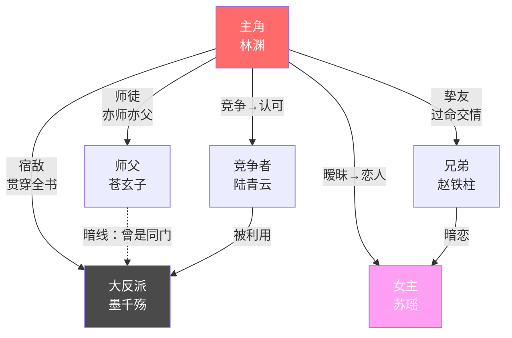

# Phase 3: 人物塑造 & 关系网络

> **阶段编号**: Phase 3 / 10
> **执行角色**: 👤 人物心理师
> **触发条件**: Phase 2 完成，世界观设定已建立
> **阶段目标**: 创建立体、一致、有成长弧线的角色体系，建立防漂移机制
> **输出产物**: `settings/characters/` 目录全部角色卡 + `relationships.md` 关系网络图

---

## 一、阶段概述

人物是网文的灵魂。读者追更的核心动力不是情节，而是对角色命运的关心。一个好的角色系统需要做到：
- **立体**：不是脸谱化的好人/坏人
- **一致**：性格表现前后统一，不会突然OOC
- **成长**：有清晰的内在变化弧线
- **区分**：每个角色有独特的说话方式和行为模式

**核心理念**：角色不是作者的提线木偶，而是有自己内在逻辑的"人"。当情节需要和角色性格冲突时，修改情节，不要扭曲角色。

---

## 二、角色卡系统

### 2.1 五维人格DNA模型

每个重要角色都通过五个维度的滑块来定义其核心人格。每个维度取值 1-10：

```
【五维人格DNA】

理智 [████████░░] 8 ←→ 冲动 2
温和 [███░░░░░░░] 3 ←→ 强硬 7
独立 [█████████░] 9 ←→ 依赖 1
乐观 [█████░░░░░] 5 ←→ 悲观 5
诚实 [██████░░░░] 6 ←→ 狡诈 4
```

**维度详解**：

| 维度 | 低分表现 | 高分表现 | 影响范围 |
|------|---------|---------|---------|
| 理智←→冲动 | 三思后行、计划周密 | 直觉行动、感情用事 | 决策方式、危机处理 |
| 温和←→强硬 | 退让包容、避免冲突 | 寸步不让、主动对抗 | 人际互动、谈判风格 |
| 独立←→依赖 | 独来独往、自我决断 | 重视团队、需要认同 | 社交模式、成长方向 |
| 乐观←→悲观 | 积极向上、信任他人 | 警惕多疑、准备最坏 | 内心独白、面对挫折 |
| 诚实←→狡诈 | 坦诚直率、不善伪装 | 心机深沉、善于伪装 | 对话风格、策略选择 |

### 2.2 完整角色卡模板

```markdown
# 🎭 角色卡：[角色名]

## 基本信息
- **全名**：xxx
- **年龄**：xx岁（初登场时）
- **身份**：天玄宗外门弟子
- **境界**：炼气三层（初始）
- **外貌特征**：（2-3个最显著的外貌标签，不要写成选美描述）

## 五维人格DNA
- 理智 8 / 冲动 2 —— "永远先想三步再走一步"
- 温和 3 / 强硬 7 —— "不主动惹事，但绝不退让"
- 独立 9 / 依赖 1 —— "习惯一个人解决所有问题"
- 乐观 5 / 悲观 5 —— "不盲目乐观，也不轻易绝望"
- 诚实 6 / 狡诈 4 —— "对朋友坦诚，对敌人不讲规矩"

## 核心驱动力
- **表层目标**：变强，在宗门站稳脚跟
- **深层目标**：找到失踪的师父，揭开身世之谜
- **终极渴望**：获得真正的归属感（从孤儿到有家）

## 致命弱点
- 过度独立导致不善于求助
- 对"抛弃"极度敏感（源于孤儿经历）
- 理智的外表下压抑着巨大的愤怒

## 说话风格
- 简短精炼，不爱废话
- 使用比喻时偏好自然意象（风、石、水）
- 紧张时会不自觉地攥拳（身体语言标签）
- 生气时反而更安静（反差标签）
- **常用口头禅**："没那么复杂。"
- **绝不会说**："我需要你的帮助"（除非极端情况下的突破性成长时刻）

## 行为红线（绝对不会做的事）
1. ❌ 绝不背叛已经认定的朋友
2. ❌ 绝不对无辜者下杀手
3. ❌ 绝不乞求敌人饶命
4. ❌ 绝不在同伴面前流泪（前期）

## 角色弧线规划
### 起点状态（第1卷）
- 孤僻、不信任他人、独来独往
- 相信"只有自己才靠得住"

### 转折点（第2-3卷）
- 通过与伙伴并肩作战，开始接受他人
- 关键事件：xxx（打破心墙的具体情节）

### 终点状态（全书结尾）
- 学会信任和依赖他人
- 从"一个人的战斗"到"为守护的人而战"
- 五维变化：独立 9→6，温和 3→5

## 战斗风格
- 偏好以智取胜，善于利用环境
- 擅长防守反击，不喜欢正面硬刚
- 特色招式/能力：xxx
```

### 2.3 配角分级系统

不是所有角色都需要完整角色卡。按重要性分级：

| 等级 | 说明 | 所需信息 | 示例 |
|------|------|---------|------|
| S级 | 主角 | 完整角色卡 + 详细弧线 | 男/女主角 |
| A级 | 核心配角 | 完整角色卡 + 简要弧线 | 最佳搭档、主要反派 |
| B级 | 重要配角 | 简化角色卡（人格DNA + 说话风格 + 红线） | 师父、门派同门 |
| C级 | 功能配角 | 一句话描述 + 功能标签 | "冷面长老，负责考核" |
| D级 | 路人 | 无需预设 | 随机NPC |

---

## 三、关系网络设计

### 3.1 关系类型分类

```
关系类型：
├─ 正向关系
│  ├─ 师徒（引导+成长）
│  ├─ 挚友/兄弟（信任+支持）
│  ├─ 恋人（感情+牵挂）
│  └─ 恩人（感恩+责任）
├─ 负向关系
│  ├─ 宿敌（对立+碰撞）
│  ├─ 竞争者（竞争+刺激）
│  ├─ 仇人（仇恨+驱动力）
│  └─ 背叛者（创伤+成长）
└─ 复杂关系
   ├─ 亦敌亦友（张力最强）
   ├─ 暗恋/单相思（情感张力）
   └─ 利益同盟（随时可能瓦解）
```

### 3.2 关系网络 Mermaid 图示

用 Mermaid 图可视化角色关系，便于全局把控：



### 3.3 关系变化时间表

| 卷 | 主角↔师父 | 主角↔女主 | 主角↔反派 | 主角↔竞争者 |
|----|----------|----------|----------|------------|
| 第1卷 | 初遇，拜师 | 初见，好感 | 尚未接触 | 对立冲突 |
| 第2卷 | 师父失踪 | 并肩作战 | 初次交锋 | 竞争升级 |
| 第3卷 | 寻师线索 | 感情确立 | 直接对抗 | 化敌为友 |
| 第4卷 | 真相揭露 | 分离考验 | 决战准备 | 并肩作战 |

---

## 四、防漂移机制（Anti-Drift）

### 4.1 什么是角色漂移？

**角色漂移（Character Drift）** 是 AI 写作中最常见的问题之一：
- 原本冷静的角色突然变得冲动
- 从不求人的角色突然开口求助
- 说话风格突然变了（原本简洁的变成话痨）
- 行为违背了设定的红线

### 4.2 防漂移检查清单

在 Phase 7（正文生成）中，每次写到角色行为/对话时，必须检查：

```
【角色一致性快检】
□ 这个行为符合角色的五维人格DNA吗？
□ 这个对话符合角色的说话风格吗？
□ 这个决策符合角色的核心驱动力吗？
□ 有没有触犯行为红线？
□ 如果角色确实要做出"反常"举动，是否有充分的情节铺垫？
```

### 4.3 合理的性格突破 vs 错误的性格漂移

| | 合理突破 | 错误漂移 |
|--|---------|---------|
| 前提 | 有重大事件触发 + 足够的内心描写 | 无缘无故、突然变化 |
| 幅度 | 五维DNA单项变化不超过2点 | 性格完全翻转 |
| 持续性 | 变化后保持新状态 | 下一章又变回去 |
| 读者感受 | "终于等到这一刻" | "这还是同一个人吗？" |

---

## 五、实用工具与技巧

### 5.1 角色起名原则

- **风格匹配**：修仙世界用古风名（林渊、苏瑶），都市用现代名
- **含义暗示**：名字可以暗示性格或命运（但不要太明显）
- **避免混淆**：不同角色的名字首字不要相同（避免"林渊""林风""林远"同时出现）
- **好记好读**：避免生僻字和拗口的组合

### 5.2 反派设计要点

好的反派需要：
- **合理的动机**：不是"为了当坏人"而当坏人
- **有能力的威胁**：必须能真正威胁到主角
- **自洽的逻辑**：从反派的角度看，他的行为是合理的
- **与主角的镜像关系**：最好的反派是"另一种选择的主角"

---

## 六、输出文件清单

```
settings/characters/
├── protagonist.md     # 主角完整角色卡
├── heroine.md         # 女主角色卡（如适用）
├── villain-main.md    # 主要反派角色卡
├── supporting-A/      # A级配角目录
│   ├── [角色名].md
│   └── ...
├── supporting-B.md    # B级配角合集
├── relationships.md   # 关系网络图 + 变化时间表
└── naming-rules.md    # 起名规则与已用名字清单
```

---

## 七、阶段流转条件

**进入条件**: Phase 2 已完成，世界观设定文件已创建
**退出条件**:
- [ ] 主角角色卡已完成（含五维DNA、红线、弧线）
- [ ] 主要反派角色卡已完成
- [ ] 至少3个A/B级配角已创建
- [ ] 关系网络图已绘制
- [ ] 用户确认角色设定

**流转到**: Phase 4 - 全局大纲 & 故事骨架
